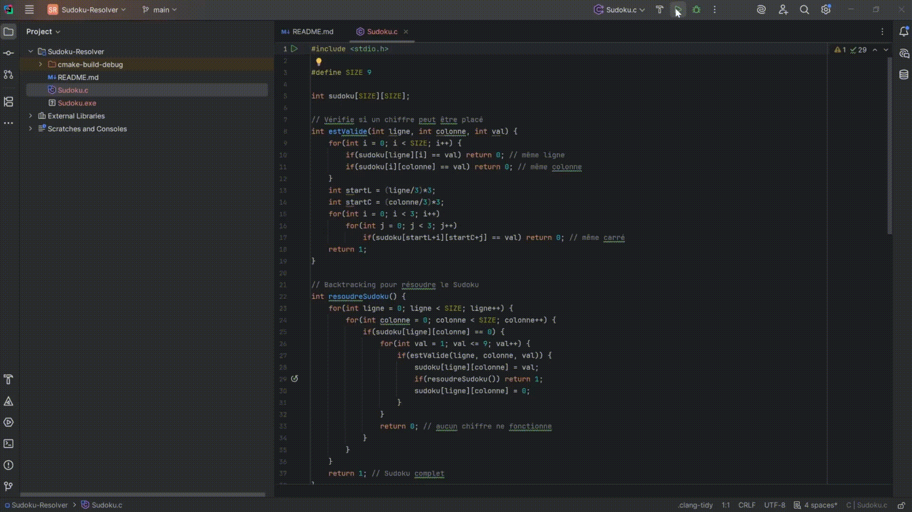

# 🧩 Sudoku Solver en C  




---

## 📖 Description

Ce projet est un petit jeu de **Sudoku en C**, pensé pour l’apprentissage et la pratique des algorithmes.  
Il permet de :  

✅ Saisir une grille **incomplète** ligne par ligne (0 = case vide).  
✅ Afficher la grille telle qu’elle a été saisie.  
✅ Résoudre automatiquement le Sudoku (si une solution existe).  
✅ Afficher la grille **complétée** avec une mise en forme lisible.
---

---

## ✨ Fonctionnalités

- 📥 Lecture de la grille **ligne par ligne**.  
- ✅ Vérification de la validité de chaque chiffre avant placement.  
- 🖼️ Affichage clair des grilles avec séparation des blocs 3x3.  
- 🚫 Détection et indication si la grille est **impossible à résoudre**.  

---

## 🕹️ Exemple d’utilisation

### 🔹 Saisie d’une grille

```
Entrez votre grille de Sudoku ligne par ligne (9 chiffres par ligne, 0 pour vide) :
Ligne 1 : 530070000
Ligne 2 : 600195000
Ligne 3 : 098000060
...
```

### Grille incomplète affichée

```
5 3 0 | 0 7 0 | 0 0 0
6 0 0 | 1 9 5 | 0 0 0
0 9 8 | 0 0 0 | 0 6 0
------+-------+------
8 0 0 | 0 6 0 | 0 0 3
4 0 0 | 8 0 3 | 0 0 1
7 0 0 | 0 2 0 | 0 0 6
------+-------+------
0 6 0 | 0 0 0 | 2 8 0
0 0 0 | 4 1 9 | 0 0 5
0 0 0 | 0 8 0 | 0 7 9
```

### Grille complétée

```
5 3 4 | 6 7 8 | 9 1 2
6 7 2 | 1 9 5 | 3 4 8
1 9 8 | 3 4 2 | 5 6 7
------+-------+------
8 5 9 | 7 6 1 | 4 2 3
4 2 6 | 8 5 3 | 7 9 1
7 1 3 | 9 2 4 | 8 5 6
------+-------+------
9 6 1 | 5 3 7 | 2 8 4
2 8 7 | 4 1 9 | 6 3 5
3 4 5 | 2 8 6 | 1 7 9
```

---
## ⚙️ Prérequis

- Un **compilateur C** (GCC recommandé).  
- Windows : via **MSYS2 MinGW 64-bit** ou MinGW-w64.  
- Linux / macOS :  
  - Linux → `sudo apt install build-essential`  
  - macOS → `xcode-select --install`  

---

## 🚀 Compilation et exécution

1. Ouvrir un terminal (ex. MSYS2 MinGW 64-bit sous Windows).  
2. Placer le fichier `Sudoku.c` dans le dossier souhaité.  
3. Compiler le programme :  

```bash
gcc Sudoku.c -o Sudoku.exe
```

4. Lancer le programme :

```bash
./Sudoku.exe
```

---

## Auteur

Samuel Bonnet – projet éducatif en C pour apprendre le **backtracking** et la gestion de tableaux 2D.
